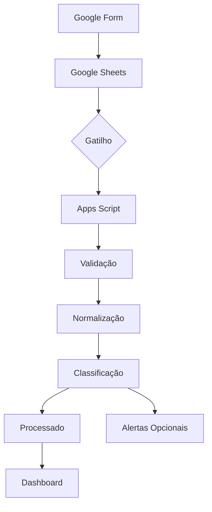

# Arquitetura Visual

## Separação de responsabilidades

- `Code.gs`: processamento e indicadores;
- `validators.gs`: validação reutilizável;
- `config.gs`: parâmetros;
- `triggers.gs`: execução automática;
- `alerts.gs`: notificações opcionais.
